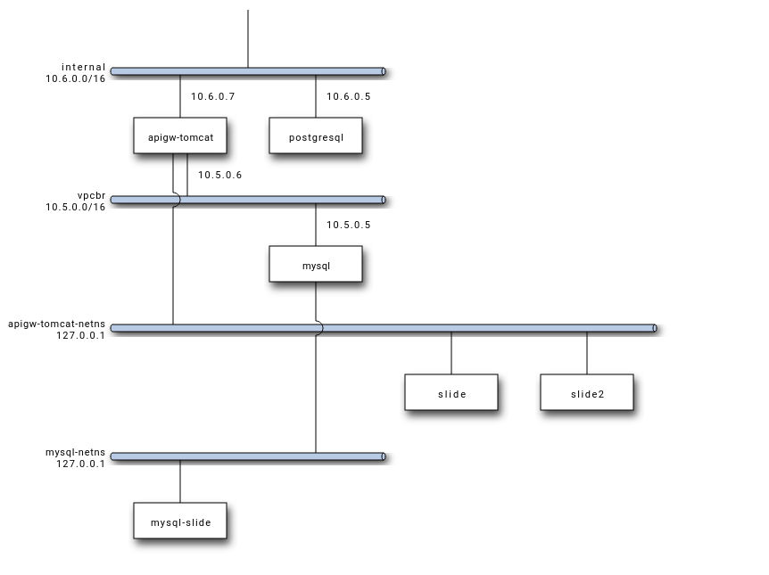
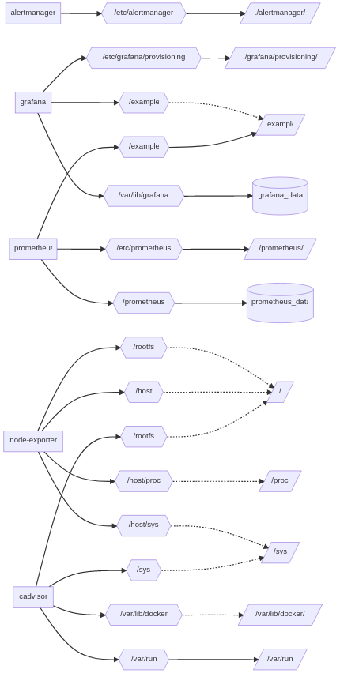

# compose-diag

## Example

### Network

#### docker-compose.yaml

#### network-docker-compose.yaml

#### network_mode-docker-compose.yaml

Support of options : network_mode

### Volumes

#### docker-compose-volume.yaml

